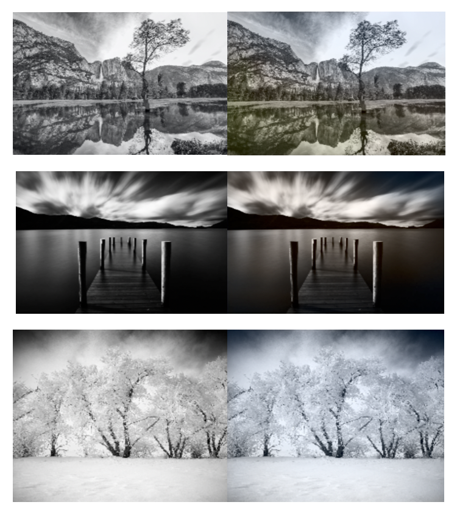

# image-colorizer

A deep convolutional neural network that turns grayscale landscape images into coloured ones! 🌈

Languages: Tensorflow, Numpy, Matplotlib, Python 🐍



## Model
The first part of the neural network uses the pretrained VGG16 network. The second part of the network is a series of 2D convolution, dropout, upsampling, and 2D convolution transpose layers. The model uses the Adam optimizer and the mean squared error loss function.

A summary of the neural network can be found below:

```
Receives grayscale input images of size (224, 224, 3), where the R, G, and B values are the same.
______________________________________________________
Layer                Output Shape              
______________________________________________________
VGG16                (None, 7, 7, 512)
Conv2D               (None, 7, 7, 256)
Conv2DTranpose       (None, 14, 14, 16)
Conv2D               (None, 14, 14, 256)
Dropout              (None, 14, 14, 256)
UpSampling2D		 (None, 28, 28, 256)
Conv2D               (None, 28, 28, 128)
Dropout              (None, 28, 28, 128)
UpSampling2D		 (None, 56, 56, 128)
Conv2D               (None, 56, 56, 64)
UpSampling2D		 (None, 112, 112, 64)
Conv2D               (None, 112, 112, 32)
Conv2D               (None, 112, 112, 2)
UpSampling2D		 (None, 224, 224, 2)
______________________________________________________
```

## Datasets
- <a href='https://www.kaggle.com/arnaud58/landscape-pictures'>Dataset 1</a>
- <a href='https://www.kaggle.com/theblackmamba31/landscape-image-colorization'>Dataset 2</a>
